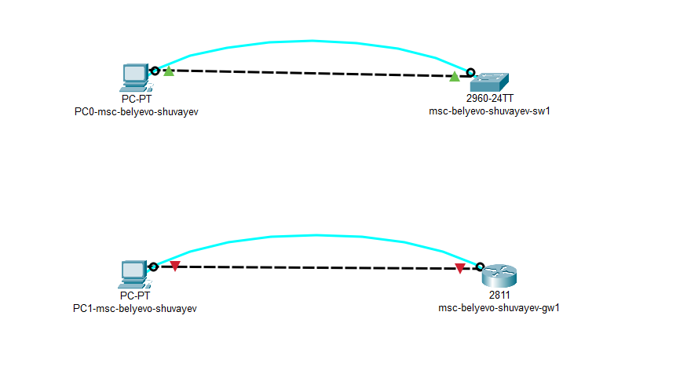
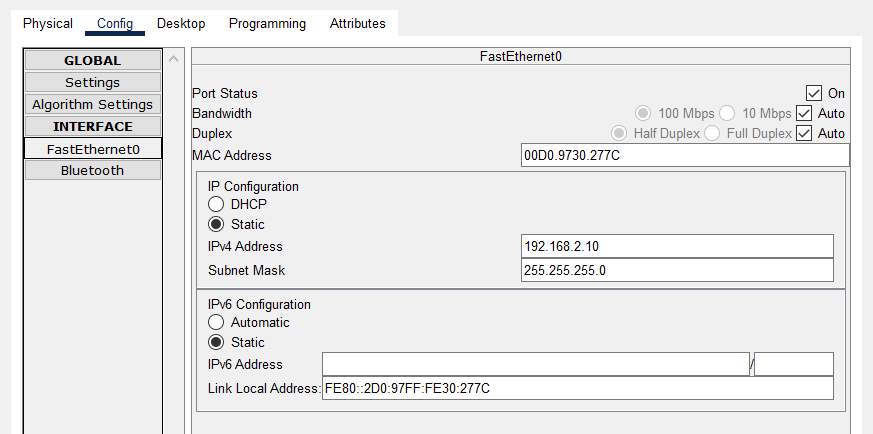
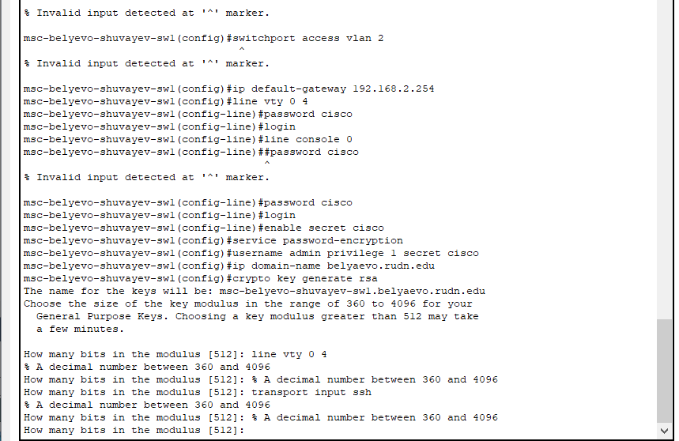
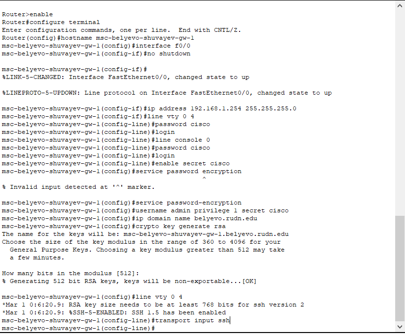
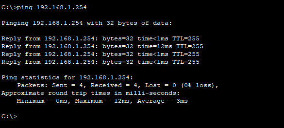

---
## Front matter
lang: ru-RU
title: Лабораторная работа №2
subtitle: Предварительная настройка оборудования Cisco
author:
  - Шуваев Сергей Александрович
institute:
  - Российский университет дружбы народов, Москва, Россия

## i18n babel
babel-lang: russian
babel-otherlangs: english

## Formatting pdf
toc: false
toc-title: Содержание
slide_level: 2
aspectratio: 169
section-titles: true
theme: metropolis
header-includes:
 - \metroset{progressbar=frametitle,sectionpage=progressbar,numbering=fraction}
 - '\makeatletter'
 - '\beamer@ignorenonframefalse'
 - '\makeatother'
---

# Информация

## Докладчик

:::::::::::::: {.columns align=center}
::: {.column width="70%"}

  * Шуваев Сергей Александрович
  * студент
  * Российский университет дружбы народов
  * [1032224269@pfur.ru](mailto:1032224269@pfur.ru)
  * <https://Grinders060050.github.io/ru/>

:::
::: {.column width="25%"}

:::
::::::::::::::

## Цель работы
Освоить предварительную настройку оборудования CISCO

## Задание

Сделать предварительную настройку маршрутизатора:
– задать имя в виде «город-территория-учётная_записьтип_оборудования-номер» (см. пункт 2.5), например
msk-donskaya-osbender-gw-1;
– задать интерфейсу Fast Ethernet с номером 0 ip-адрес 192.168.1.254
и маску 255.255.255.0, затем поднять интерфейс;
– задать пароль для доступа к привилегированному режиму (сначала
в открытом виде, затем — в зашифрованном);
– настроить доступ к оборудованию сначала через telnet, затем — через
ssh (используя в качестве имени домена donskaya.rudn.edu);
– сохранить и экспортировать конфигурацию в отдельный файл.

## Выполнение лабораторной работы

2. Сделать предварительную настройку коммутатора:
– задать имя в виде «город-территория-учётная_записьтип_оборудования-номер» (см. пункт 2.5), например
msk-donskaya-osbender-sw-1;
– задать интерфейсу vlan 2 ip-адрес 192.168.2.1 и маску 255.255.255.0,
затем поднять интерфейс;
– привязать интерфейс Fast Ethernet с номером 1 к vlan 2;
– задать в качестве адреса шлюза по умолчанию адрес 192.168.2.254;
– задать пароль для доступа к привилегированному режиму (сначала
в открытом виде, затем — в зашифрованном);

## Выполнение лабораторной работы

– настроить доступ к оборудованию сначала через telnet, затем — через
ssh (используя в качестве имени домена donskaya.rudn.edu);
– для пользователя admin задать доступ 1-го уровня по паролю;
– сохранить и экспортировать конфигурацию в отдельный файл.

## Выполнение лабораторной работы

В логической рабочей области Packet Tracer размещаем коммутатор,
маршрутизатор и 2 оконечных устройства типа PC, соедините один PC
с маршрутизатором, другой PC — с коммутатором

## Выполнение лабораторной работы

## Выполнение лабораторной работы

Проведем настройку маршрутизатора в соответствии с заданием, ориентируясь на приведённую ниже часть конфигурации маршрутизатора

## Выполнение лабораторной работы

Проведем настройку коммутатора в соответствии с заданием, ориентируясь
на приведённую ниже часть конфигурации коммутатора

## Выполнение лабораторной работы

## Выполнение лабораторной работы

## Выполнение лабораторной работы

## Выполнение лабораторной работы

## Выполнение лабораторной работы

#Контрольные вопросы и ответы на них.

1. Укажите возможные способы подключения к сетевому оборудованию.

Ответ:Можно подключиться с помощью консольного кабеля или удаленно по ssh или telnet.

## Выполнение лабораторной работы

2. Каким типом сетевого кабеля следует подключать оконечное оборудование
пользователя к маршрутизатору и почему?

Ответ:Кроссовым кабелем

## Выполнение лабораторной работы

3. Каким типом сетевого кабеля следует подключать оконечное оборудование
пользователя к коммутатору и почему?

Ответ:Прямым кабелем (витой парой).

## Выполнение лабораторной работы

4. Каким типом сетевого кабеля следует подключать коммутатор к коммутатору и почему?

Ответ:Кроссовым кабелем (для соединения одинокого оборудования используют кроссовый кабель)

## Выполнение лабораторной работы

5. Укажите возможные способы настройки доступа к сетевому оборудованию
по паролю.

Ответ:С помощью команды password или с помощью команды secret

## Выполнение лабораторной работы

6. Укажите возможные способы настройки удалённого доступа к сетевому
оборудованию. Какой из способов предпочтительнее и почему?
Ответ:
Через telnet или ssh. SSH обеспечивает шифрование и аутентификацию по умолчанию, в отличие от Telnet, который не предоставляет эти функции, поэтому он лучше.

## Выполнение лабораторной работы

# Выводы

В процессе выполнения работы научился делать прелварительные настройки оборудования CISCO.