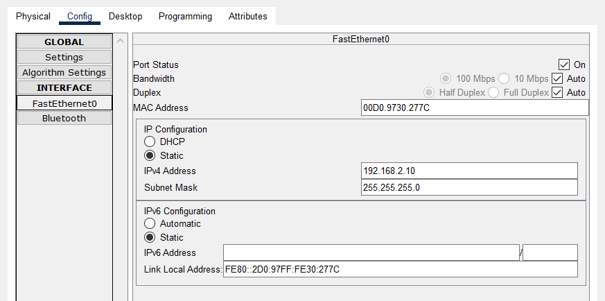
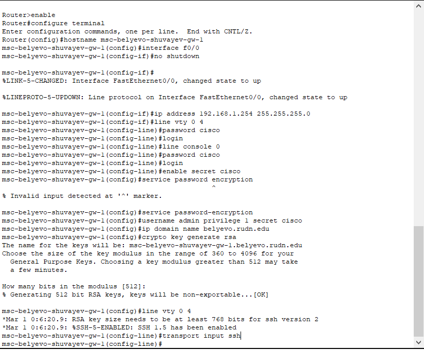
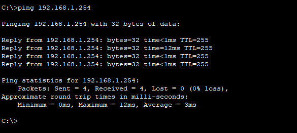

---
## Front matter
title: "Лабораторная работа № 2"
subtitle: "Предварительная настройка оборудования Cisco"
author: "Шуваев Сергей Александрович"

## Generic otions
lang: ru-RU
toc-title: "Содержание"

## Bibliography
bibliography: bib/cite.bib
csl: pandoc/csl/gost-r-7-0-5-2008-numeric.csl

## Pdf output format
toc: true # Table of contents
toc-depth: 2
lof: true # List of figures
lot: false # List of tables
fontsize: 12pt
linestretch: 1.5
papersize: a4
documentclass: scrreprt
## I18n polyglossia
polyglossia-lang:
  name: russian
  options:
	- spelling=modern
	- babelshorthands=true
polyglossia-otherlangs:
  name: english
## I18n babel
babel-lang: russian
babel-otherlangs: english
## Fonts
mainfont: PT Serif
romanfont: PT Serif
sansfont: PT Sans
monofont: PT Mono
mainfontoptions: Ligatures=TeX
romanfontoptions: Ligatures=TeX
sansfontoptions: Ligatures=TeX,Scale=MatchLowercase
monofontoptions: Scale=MatchLowercase,Scale=0.9
## Biblatex
biblatex: true
biblio-style: "gost-numeric"
biblatexoptions:
  - parentracker=true
  - backend=biber
  - hyperref=auto
  - language=auto
  - autolang=other*
  - citestyle=gost-numeric
## Pandoc-crossref LaTeX customization
figureTitle: "Рис."
tableTitle: "Таблица"
listingTitle: "Листинг"
lofTitle: "Список иллюстраций"
lotTitle: "Список таблиц"
lolTitle: "Листинги"
## Misc options
indent: true
header-includes:
  - \usepackage{indentfirst}
  - \usepackage{float} # keep figures where there are in the text
  - \floatplacement{figure}{H} # keep figures where there are in the text
---

# Цель работы

Освоить предварительную настройку оборудования CISCO

# Задание
1. Сделать предварительную настройку маршрутизатора:
– задать имя в виде «город-территория-учётная_записьтип_оборудования-номер» (см. пункт 2.5), например
msk-donskaya-osbender-gw-1;
– задать интерфейсу Fast Ethernet с номером 0 ip-адрес 192.168.1.254
и маску 255.255.255.0, затем поднять интерфейс;
– задать пароль для доступа к привилегированному режиму (сначала
в открытом виде, затем — в зашифрованном);
– настроить доступ к оборудованию сначала через telnet, затем — через
ssh (используя в качестве имени домена donskaya.rudn.edu);
– сохранить и экспортировать конфигурацию в отдельный файл.
2. Сделать предварительную настройку коммутатора:
– задать имя в виде «город-территория-учётная_записьтип_оборудования-номер» (см. пункт 2.5), например
msk-donskaya-osbender-sw-1;
– задать интерфейсу vlan 2 ip-адрес 192.168.2.1 и маску 255.255.255.0,
затем поднять интерфейс;
– привязать интерфейс Fast Ethernet с номером 1 к vlan 2;
– задать в качестве адреса шлюза по умолчанию адрес 192.168.2.254;
– задать пароль для доступа к привилегированному режиму (сначала
в открытом виде, затем — в зашифрованном);
– настроить доступ к оборудованию сначала через telnet, затем — через
ssh (используя в качестве имени домена donskaya.rudn.edu);
– для пользователя admin задать доступ 1-го уровня по паролю;
– сохранить и экспортировать конфигурацию в отдельный файл.

# Выполнение лабораторной работы

1. В логической рабочей области Packet Tracer разместим коммутатор,
маршрутизатор и 2 оконечных устройства типа PC, соедините один PC
с маршрутизатором, другой PC — с коммутатором

2. Проведем настройку маршрутизатора в соответствии с заданием, ориентируясь на приведённую ниже часть конфигурации маршрутизатора 
3. Проведем настройку коммутатора в соответствии с заданием, ориентируясь
на приведённую ниже часть конфигурации коммутатора.
4. Проверим работоспособность соединений с помощью команды ping.
5. Попробуем подключиться к коммутатору и маршрутизатору разными способами: с помощью консольного кабеля, по протоколу удалённого доступа
(telnet, ssh).

Конфигурация коммутатора

#Контрольные вопросы и ответы на них.

1. Укажите возможные способы подключения к сетевому оборудованию.
Ответ:Можно подключиться с помощью консольного кабеля или удаленно по ssh или telnet.
2. Каким типом сетевого кабеля следует подключать оконечное оборудование
пользователя к маршрутизатору и почему?
Ответ:Кроссовым кабелем
3. Каким типом сетевого кабеля следует подключать оконечное оборудование
пользователя к коммутатору и почему?
Ответ:Прямым кабелем (витой парой).
4. Каким типом сетевого кабеля следует подключать коммутатор к коммутатору и почему?
Ответ:Кроссовым кабелем (для соединения одинокого оборудования используют кроссовый кабель)
5. Укажите возможные способы настройки доступа к сетевому оборудованию
по паролю.
Ответ:С помощью команды password или с помощью команды secret
6. Укажите возможные способы настройки удалённого доступа к сетевому
оборудованию. Какой из способов предпочтительнее и почему?
Ответ:
Через telnet или ssh. SSH обеспечивает шифрование и аутентификацию по умолчанию, в отличие от Telnet, который не предоставляет эти функции, поэтому он лучше.

# Выводы

В процессе выполнения работы научился делать прелварительные настройки оборудования CISCO.