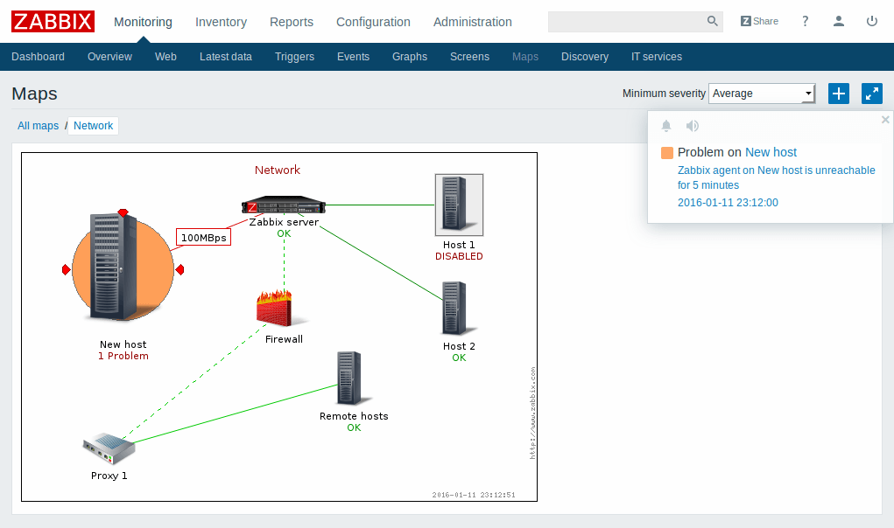
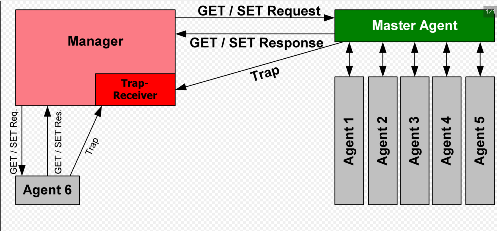
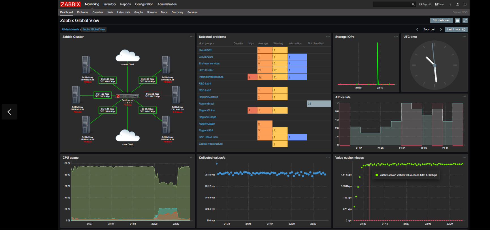
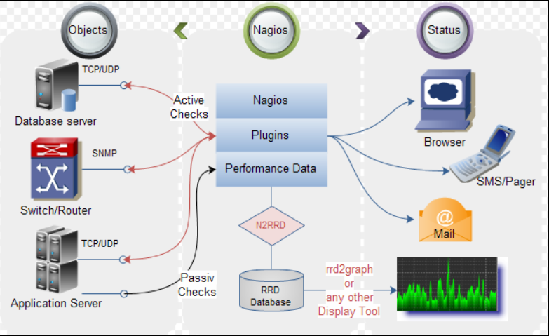
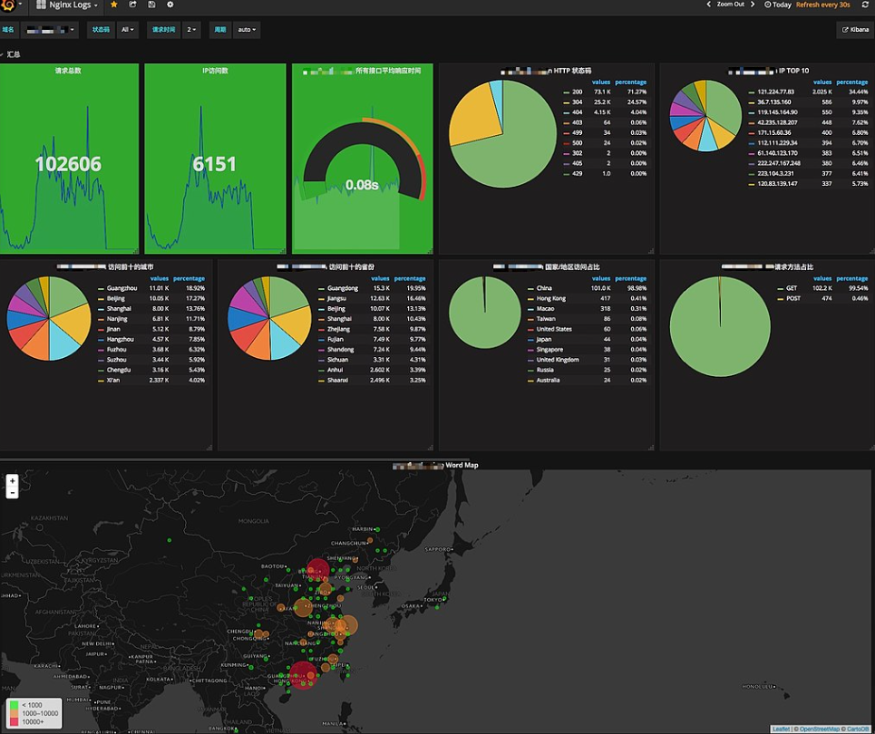
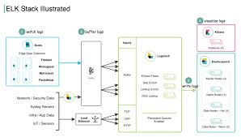
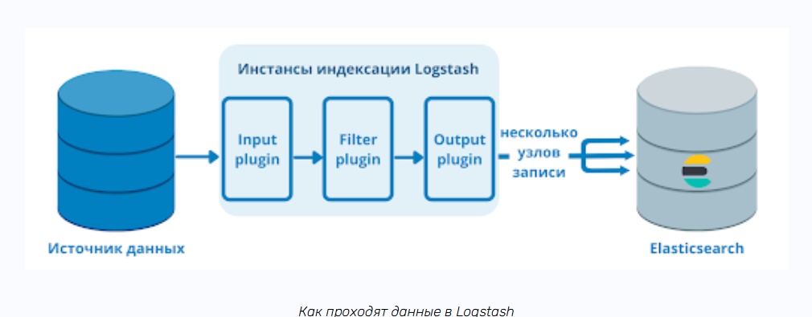
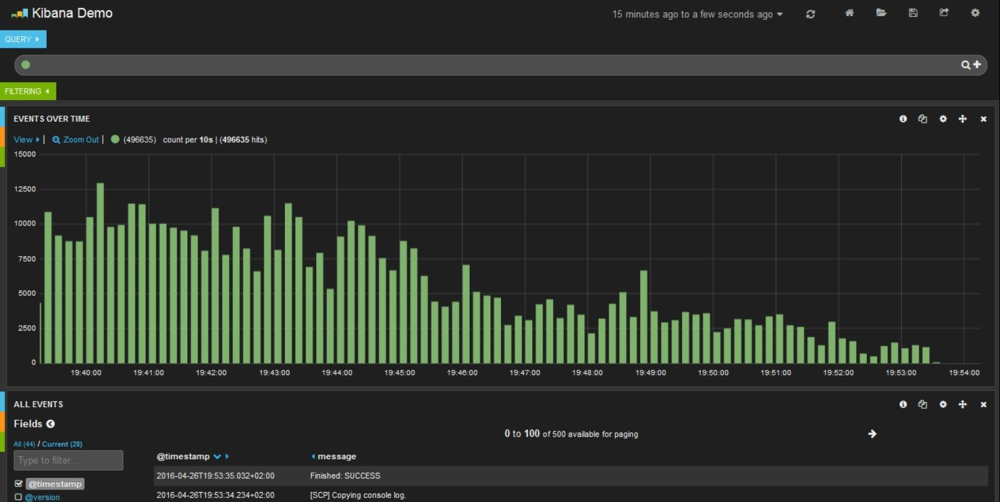
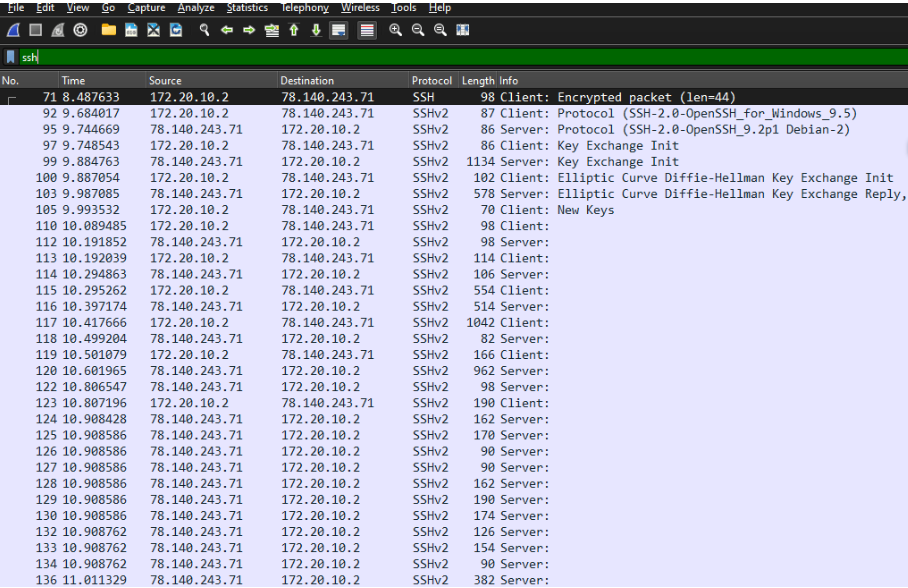
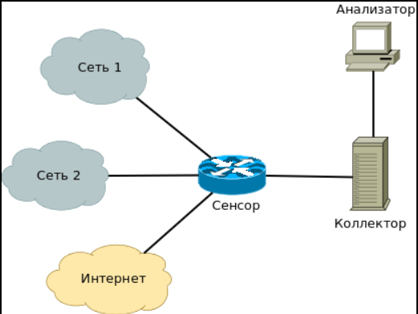

---
## Front matter
lang: ru-RU
title: "Доклад"
subtitle: "Мониторинг в сетях. (SNMP, агенты, Zabbix, Nagios)."
author:
  - Шуваев С. А.
institute:
  - Российский университет дружбы народов, Москва, Россия

## i18n babel
babel-lang: russian
babel-otherlangs: english

## Formatting pdf
toc: false
toc-title: Содержание
slide_level: 2
aspectratio: 169
section-titles: true
theme: metropolis
header-includes:
 - \metroset{progressbar=frametitle,sectionpage=progressbar,numbering=fraction}
 - '\makeatletter'
 - '\beamer@ignorenonframefalse'
 - '\makeatother'
---

# Информация

## Докладчик

:::::::::::::: {.columns align=center}
::: {.column width="70%"}

  * Шуваев Сергей Александрович
  * студент
  * Российский университет дружбы народов
  * [1032224269@pfur.ru](mailto:1032224269@pfur.ru)
  * <https://Grinders060050.github.io/ru/>

:::
::: {.column width="40%"}

:::
::::::::::::::

## Цель работы

Подготовить доклад Мониторинг в сетях. (SNMP, агенты, Zabbix, Nagios).

## "Мониторинг в сетях. (SNMP, агенты, Zabbix, Nagios)."
1. Темы докладов распределены по лекциям.
2. Тема должна быть уникальна в рамках направления подготовки. Дублирующие доклады не принимаются.
3. У студента учитывается только один доклад.
4. При представлении доклада после лекции, к которой привязана тема доклада, оценка снижается.
5. Оценка формируется из следующих элементов:
 - оформление презентации (объем презентации 5-12 слайдов);
 - выступление по теме доклада (5-10 минут);
 - содержание доклада (раскрытие темы, четкость изложения, подбор источников литературы);
 - оформление текста по теме доклада (5-12 стр.).
 - оценка выставляется только после выкладывания на сайт презентации и текста доклада.
 - для получения оценки обязательно представление презентации во время соответствующего лекционного занятия.

## "Zabbix vs Nagios vs Pandora FMS"

{#fig:001 width=60%}

## "Агенты мониторинга"

{#fig:002 width=60%}

## "Системы мониторинга

{#fig:003 width=60%}

## "Nagios (и его форки: Nagios Core, Icinga, Naemon)"

{#fig:004 width=60%}

## Prometheus + Grafana

{#fig:005 width=60%}

## ELK-стек (Elasticsearch, Logstash, Kibana)

{#fig:006 width=60%}

## ELK-стек (Elasticsearch, Logstash, Kibana)

{#fig:007 width=60%}

## ELK-стек (Elasticsearch, Logstash, Kibana)

{#fig:008 width=60%}

## Wireshark & Tcpdump

{#fig:009 width=60%}

## NetFlow/sFlow/IPFIX

{#fig:010 width=60%}

## Сравнение систем мониторинга

|Критерий        |           Zabbix              |                 Nagios         |          Prometheus              |            ELK              |
|----------------|-------------------------------|--------------------------------|----------------------------------|-----------------------------|
|Тип данных      |Метрики + логи (с дополнениями)| Метрики (через плагины)        |Метрики + события                 |      Логи + трафик          |
|Масштабируемость|Высокая (Proxy, кластеризация) | Средняя (требует доп. настроек)|Очень высокая (для cloud-native)  |Высокая (шардирование в ES)  |
|Визуализация    | Дашборды, графики, карты      | Ограниченная (нужна Grafana)   |              Grafana             |Kibana (лог-аналитика)       |
|Оповещения      | Гибкие (Email, SMS, Telegram) | Email, SMS, скрипты            |Alertmanager (Slack, PagerDuty)   |Watchers (алерты на логи)    |
|Сложность       |Средняя                        | Низкая (базовый функционал)    |Высокая (требует понимания метрик)|Высокая (настройка pipelines)|

: Таблица Сравнение систем мониторинга {#tbl:Nagios}

## Рекомендации по выбору.

Для сетевого оборудования → Zabbix + SNMP.
Для облаков и микросервисов → Prometheus + Grafana.
Для логов и безопасности → ELK-стек.
Для глубокого анализа трафика → Wireshark + NetFlow.