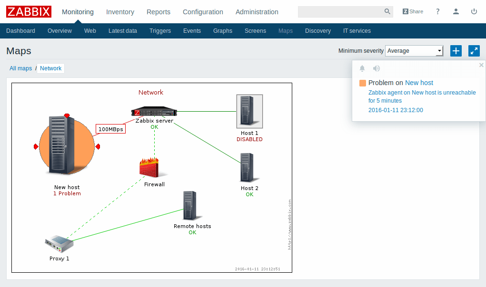
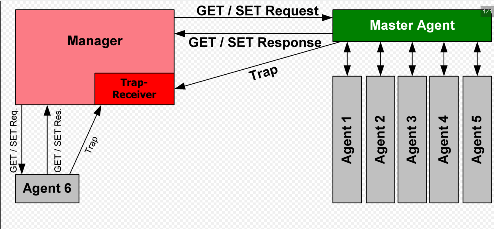
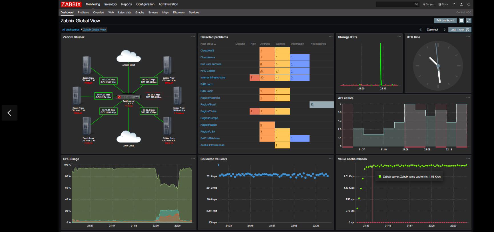
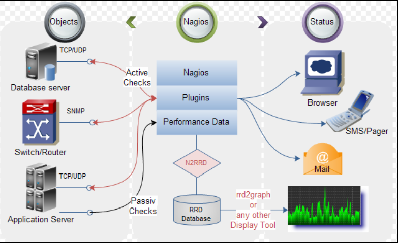
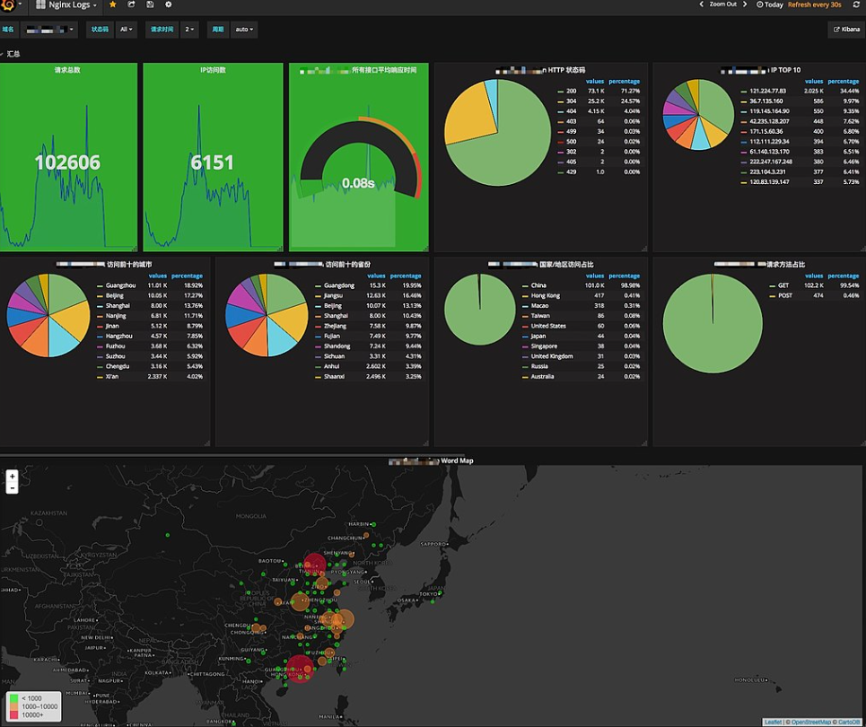
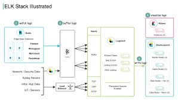
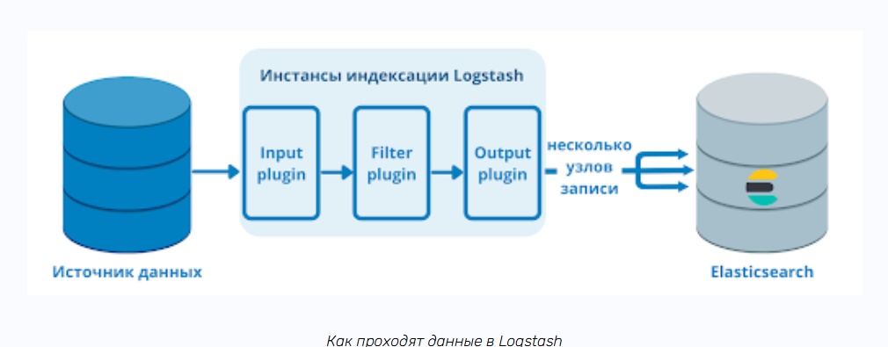
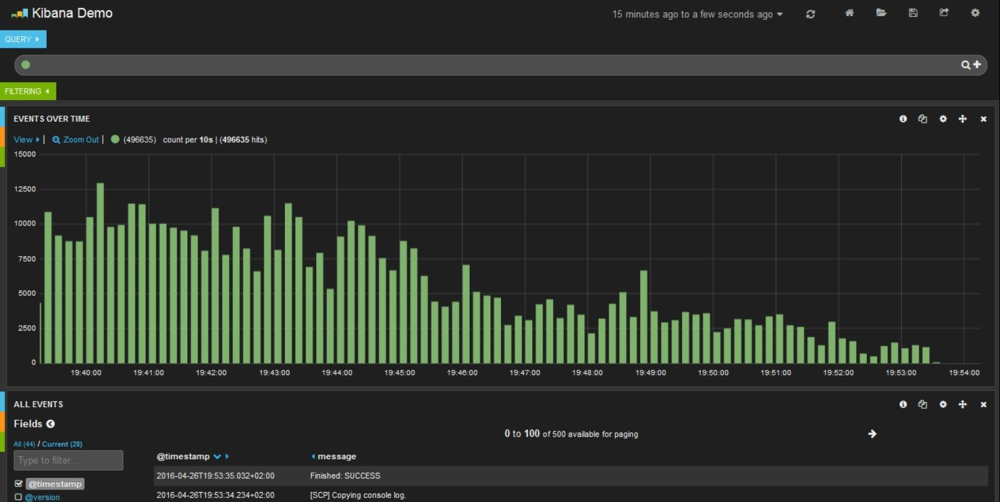
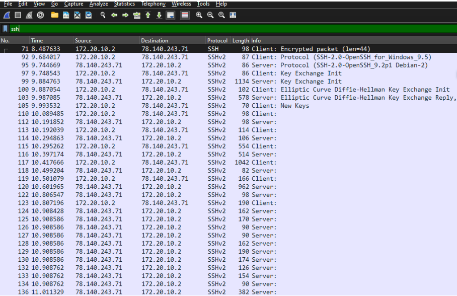
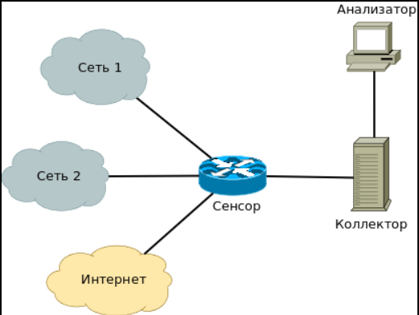

---
## Front matter
title: "Доклад"
subtitle: "Мониторинг в сетях. (SNMP, агенты, Zabbix, Nagios)."
author: "Шуваев Сергей Александрович"

## Generic otions
lang: ru-RU
toc-title: "Содержание"

## Bibliography
bibliography: bib/cite.bib
csl: pandoc/csl/gost-r-7-0-5-2008-numeric.csl

## Pdf output format
toc: true # Table of contents
toc-depth: 2
lof: true # List of figures
lot: true # List of tables
fontsize: 12pt
linestretch: 1.5
papersize: a4
documentclass: scrreprt
## I18n polyglossia
polyglossia-lang:
  name: russian
  options:
	- spelling=modern
	- babelshorthands=true
polyglossia-otherlangs:
  name: english
## I18n babel
babel-lang: russian
babel-otherlangs: english
## Fonts
mainfont: PT Serif
romanfont: PT Serif
sansfont: PT Sans
monofont: PT Mono
mainfontoptions: Ligatures=TeX
romanfontoptions: Ligatures=TeX
sansfontoptions: Ligatures=TeX,Scale=MatchLowercase
monofontoptions: Scale=MatchLowercase,Scale=0.9
## Biblatex
biblatex: true
biblio-style: "gost-numeric"
biblatexoptions:
  - parentracker=true
  - backend=biber
  - hyperref=auto
  - language=auto
  - autolang=other*
  - citestyle=gost-numeric
## Pandoc-crossref LaTeX customization
figureTitle: "Рис."
tableTitle: "Таблица"
listingTitle: "Листинг"
lofTitle: "Список иллюстраций"
lotTitle: "Список таблиц"
lolTitle: "Листинги"
## Misc options
indent: true
header-includes:
  - \usepackage{indentfirst}
  - \usepackage{float} # keep figures where there are in the text
  - \floatplacement{figure}{H} # keep figures where there are in the text
---

# Цель работы

Подготовить доклад Мониторинг в сетях. (SNMP, агенты, Zabbix, Nagios).

# Задание

1. Темы докладов распределены по лекциям.
2. Тема должна быть уникальна в рамках направления подготовки. Дублирующие доклады не принимаются.
3. У студента учитывается только один доклад.
4. При представлении доклада после лекции, к которой привязана тема доклада, оценка снижается.
5. Оценка формируется из следующих элементов:
 - оформление презентации (объем презентации 5-12 слайдов);
 - выступление по теме доклада (5-10 минут);
 - содержание доклада (раскрытие темы, четкость изложения, подбор источников литературы);
 - оформление текста по теме доклада (5-12 стр.).
 - оценка выставляется только после выкладывания на сайт презентации и текста доклада.
 - для получения оценки обязательно представление презентации во время соответствующего лекционного занятия.

# Доклад

Введение:
Мониторинг сетевой инфраструктуры — важная задача для обеспечения стабильности, безопасности и производительности ИТ-систем. В этом отчете рассматриваются ключевые технологии и инструменты мониторинга: SNMP, агенты, Zabbix и Nagios.

Zabbix vs Nagios vs Pandora FMS(рис. [-@fig:001]).

{#fig:001 width=70%}

# Основные технологии мониторинга

SNMP (Simple Network Management Protocol)

Назначение: протокол для сбора и управления данными сетевых устройств (роутеры, коммутаторы, серверы).

Версии:

SNMPv1/v2c – простые, но без шифрования (используют community strings).

SNMPv3 – поддерживает аутентификацию и шифрование.

Режимы работы:

Polling – запрос данных с устройств (GET, GETNEXT).

Trap – асинхронные уведомления о событиях.

# Агенты мониторинга
Назначение: программы, собирающие метрики с устройств и передающие их на сервер мониторинга.
Типы:
Встроенные (например, snmpd для Linux).
Сторонние (Zabbix Agent, NRPE для Nagios).
Преимущества:
Более детальный мониторинг (диски, процессы, логи).
Меньшая нагрузка на сеть по сравнению с SNMP. 

{#fig:002 width=70%}

# Системы мониторинга

Zabbix
Тип: универсальная система мониторинга с открытым исходным кодом.
Особенности:
Поддержка SNMP, агентов, IPMI, JMX.
Гибкие триггеры и оповещения (Email, SMS, Telegram).
Встроенные шаблоны для мониторинга сетевых устройств.
Визуализация через графики, дашборды, карты сетей.

Архитектура:

Сервер + агенты + веб-интерфейс + база данных (MySQL, PostgreSQL). 

{#fig:003 width=70%}

# Nagios (и его форки: Nagios Core, Icinga, Naemon)

Тип: классическая система мониторинга с упором на оповещения.
Особенности:
Базируется на плагинах (через NRPE или SSH).
Простая конфигурация через текстовые файлы.
Поддержка SNMP через дополнительные модули.
Оповещения по email, SMS, мессенджерам.

Недостатки:
Сложность масштабирования.
Ограниченная визуализация (требуются доп. инструменты, например, Grafana).

{#fig:004 width=70%}

# Prometheus + Grafana
Тип: система мониторинга и визуализации (open-source).
Особенности:
Pull-модель (забирает метрики через HTTP).
Многоразмерные данные (метки вместо иерархии).
Alertmanager – управление оповещениями.
Grafana – мощные дашборды.

Использование:

Мониторинг Kubernetes, микросервисов, облачных сред.

{#fig:005 width=70%}

# ELK-стек (Elasticsearch, Logstash, Kibana)
Назначение: сбор и анализ логов.
Компоненты:
Filebeat – сбор логов.
Logstash – обработка и фильтрация.
Elasticsearch – хранение и поиск.
Kibana – визуализация.

Применение:

Анализ сетевых аномалий, безопасность (SIEM).

{#fig:006 width=70%}

{#fig:007 width=70%}

{#fig:008 width=70%}

# Wireshark & Tcpdump
Назначение: глубокий анализ сетевого трафика.
Использование:
Диагностика DDoS, атак, проблем с QoS.
Фильтрация по IP, портам, протоколам. 

{#fig:009 width=70%}

# NetFlow/sFlow/IPFIX
Назначение: мониторинг трафика (источник/получатель, объемы).
Инструменты:
nProbe, ntopng, SolarWinds NetFlow Traffic Analyzer.(рис. [-@fig:0010])

{#fig:0010 width=70%}

# Сравнение систем мониторинга

|Критерий        |           Zabbix              |                 Nagios         |          Prometheus              |            ELK              |
|----------------|-------------------------------|--------------------------------|----------------------------------|-----------------------------|
|Тип данных      |Метрики + логи (с дополнениями)| Метрики (через плагины)        |Метрики + события                 |      Логи + трафик          |
|Масштабируемость|Высокая (Proxy, кластеризация) | Средняя (требует доп. настроек)|Очень высокая (для cloud-native)  |Высокая (шардирование в ES)  |
|Визуализация    | Дашборды, графики, карты      | Ограниченная (нужна Grafana)   |              Grafana             |Kibana (лог-аналитика)       |
|Оповещения      | Гибкие (Email, SMS, Telegram) | Email, SMS, скрипты            |Alertmanager (Slack, PagerDuty)   |Watchers (алерты на логи)    |
|Сложность       |Средняя                        | Низкая (базовый функционал)    |Высокая (требует понимания метрик)|Высокая (настройка pipelines)|

: Таблица Сравнение систем мониторинга {#tbl:Nagios}

# Рекомендации по выбору.
Для сетевого оборудования → Zabbix + SNMP.
Для облаков и микросервисов → Prometheus + Grafana.
Для логов и безопасности → ELK-стек.
Для глубокого анализа трафика → Wireshark + NetFlow.

# Источники:

По SNMP и сетевому мониторингу:

Mauro, D., Schmidt, K. Essential SNMP (2nd Edition). O’Reilly, 2005.

Habraken, J. Network Monitoring & Management. Cisco Press, 2006.

По Zabbix и Nagios:

Liebling, A. Zabbix 6 IT Infrastructure Monitoring Cookbook. Packt, 2022.

Barth, W. Nagios: System and Network Monitoring (2nd Ed.). No Starch Press, 2008.

По Prometheus и Grafana:

Jablonski, J. Prometheus: Up & Running (2nd Ed.). O’Reilly, 2023.

Smith, M. Grafana Dashboards for Monitoring. Apress, 2021.

По ELK и анализу логов:

Gheorghe, A. Elasticsearch 8 in Action. Manning, 2023.

Gururajan, P. Learning ELK Stack (2nd Ed.). Packt, 2017.

